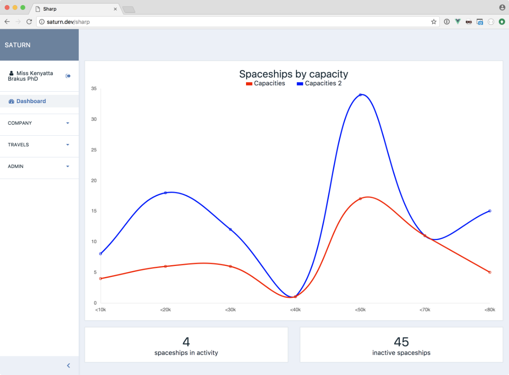
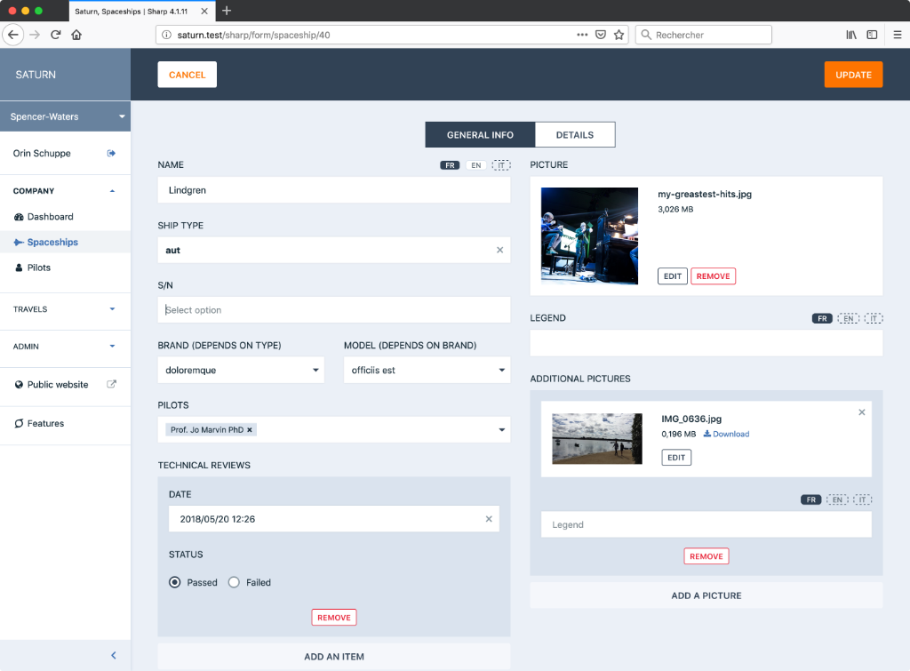

<div align="center">


</div>

Sharp is not a CMS: it's a content management framework, a toolset which provides help building a CMS section in a website, with some rules in mind:
- the public website **should not have any knowledge of the CMS** — the CMS is a part of the system, not the center of it. In fact, removing the CMS should not have any effect on the project.
- The CMS **should not have any expectations from the persistence layer**: MySQL is cool — but it's not the perfect tool for every problem. And more important, the DB structure has nothing to do with the CMS.
- Content administrators **should work with their data and terminology**, not CMS terms. I mean, if the project is about spaceships, space travels and pilots, why would the CMS talk about articles, categories and tags?
- website developers **should not have to work on the front-end development** for the CMS. Yeah. Because life is complicated enough, Sharp takes care of all the responsive / CSS / JS stuff.
 
Sharp intends to provide a clean solution to the following needs:
- create, update or delete any structured data of the project, handling validation and errors;
- display, search, sort or filter data;
- execute custom commands on one instance, a selection or all instances;
- handle authorizations and validation;
- all without write a line of front code, and using a clean API in the PHP app.

Sharp 4 needs Laravel 5.4+ and PHP 7.0+.

Here's a series of blog posts which present Sharp following a simple example:
- [Part 1](https://medium.com/@lonchampt/about-sharp-for-laravel-part-1-74a826279fe0)
- [Part 2](https://medium.com/@lonchampt/about-sharp-for-laravel-part-2-9c7779782f31)
- [Part 3: filters](https://medium.com/@lonchampt/about-sharp-for-laravel-part-3-2bb992d6a8e3)
- [Part 4: form lists](https://medium.com/@lonchampt/about-sharp-for-laravel-part-4-cb2232caf234)
- [Part 5: commands](https://medium.com/@lonchampt/about-sharp-for-laravel-part-5-44699e270647)
- [Part 6: uploads](https://medium.com/@lonchampt/about-sharp-for-laravel-part-6-a03ee71cb2c5)






## Terminology, general concept

In Sharp, we handle `entities`; and `entity` is simply a data structure which has a meaning in the applicative context. For instance, a `Person`, a `Post` or an `Order`. In the Eloquent world, for which Sharp is optimized, it's typically a Model — but it's not necessarily a 1-1 relationship, a Sharp `entity` can represent a portion of a Model, or several Models.

Each instance of an `entity` is called... an `instance`.

Each `entity` in Sharp can be displayed:
- in an `Entity List`, which is the list of all the `instances` for this `entity`: with some configuration and code, the user can sort the data, add filters, and perform a search. From there we also gain access to applicative `commands` applied to an `instance` or the whole list, and to a simple `state` changer (the publish state of an Article, for instance). All of that is described below.
- And in a `Form`, either to update or create a new `instance`.

## Installation

- Add the package with composer: `composer require code16/sharp`,
- [Laravel 5.4 only] Register the service provider `Code16\Sharp\SharpServiceProvider` in the provider array of `config/app.php`,
- Publish assets: `php artisan vendor:publish --tag=assets`.

## Configuration

Sharp needs a `config/sharp.php` config file, mainly to declare `entities`. Here's a simple example:

```php
    return [
        "entities" => [
            "spaceship" => [
                "list" => \App\Sharp\SpaceshipSharpList::class,
                "form" => \App\Sharp\SpaceshipSharpForm::class,
                "validator" => \App\Sharp\SpaceshipSharpValidator::class,
                "policy" => \App\Sharp\Policies\SpaceshipPolicy::class
            ]
        ]
    ];
```

As we can see, each `entity` (like `spaceship`, here), can define:

- a `list` class, responsible for the `Entity List`,
- a `form` class, responsible for... the `Form`
- and optionally:
	- a `validator` class, to handle form validation
	- and a `policy` class, for authorization.

We'll get into all those classes in this document. The important thing to notice is that Sharp provides base classes to handle all the wiring (and more), but as we'll see, the applicative code is totally up to you.

## Full documentation

- [Upgrading from 4.0 to 4.1](docs/upgrading/4.1.md)

### Auth

- [Authentication](docs/authentication.md)

### Entity Lists

- [Building an Entity List](docs/building-entity-list.md)
- [Filters](docs/filters.md)
- [Commands](docs/commands.md)
- [Entity States](docs/entity-states.md)
- [Reordering instances](docs/reordering-instances.md)

### Entity Forms

- [Building an Entity Form](docs/building-entity-form.md)
- Form fields:
	- [Text](docs/form-fields/text.md)
	- [Textarea](docs/form-fields/textarea.md)
	- [Markdown](docs/form-fields/markdown.md)
	- [Wysiwyg](docs/form-fields/wysiwyg.md)
	- [Number](docs/form-fields/number.md)
	- [Html](docs/form-fields/html.md)
	- [Check](docs/form-fields/check.md)
	- [Date](docs/form-fields/date.md)
	- [Upload](docs/form-fields/upload.md)
	- [Select](docs/form-fields/select.md)
	- [Autocomplete](docs/form-fields/autocomplete.md)
	- [Tags](docs/form-fields/tags.md)
	- [List](docs/form-fields/list.md)
	- [AutocompleteList](docs/form-fields/autocomplete-list.md)
	- [Geolocation](docs/form-fields/geolocation.md)
- [Entity Authorizations](docs/entity-authorizations.md)
- [Multi-forms](docs/multiforms.md)
- [Custom form fields](docs/custom-form-fields.md)

### Dashboards
- [Create a Dashboard](docs/dashboard.md)

### Generalities
- [Building the menu](docs/building-menu.md)
- [How to transform data](docs/how-to-transform-data.md)
- [Sharp built-in solution for uploads](docs/sharp-built-in-solution-for-uploads.md)
- [Handling form data localization](docs/form-data-localization.md)
- [Testing with Sharp](docs/testing-with-sharp.md)

### Theming and CSS
- [Style & Visual Theme](docs/style-visual-theme.md)
- Redefine Sharp theme (coming soon)
