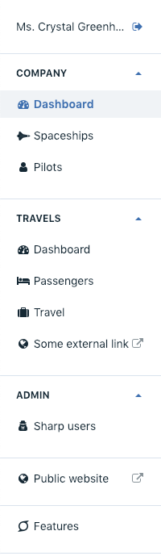

# Building the menu

The Sharp side menu can contain several links. Its organization is totally up to you, and is defined in the `sharp.php` config file.



All links shares common things:

- an icon (from [Font Awesome 4.7](https://fontawesome.com/v4.7.0/icons/))
- a label
- and an URL

Links can be grouped in categories, like Company, Travels and Admin in this example.

## Link to an entity list

```php
    // sharp.php

    [...]
    "menu" => [
        [
            "label" => "Features",
            "icon" => "fa-superpowers",
            "entity" => "feature"
        ]
    ]
```

The `entity` value must correspond to some entity key described in the same `sharp.php` file.

## Link to a dashboard

Very similar to entity lists, except that `entity` is replaced by a `dashboard` attribute which must contain a valid dashboard key:

```php
    // sharp.php

    [...]
    "menu" => [
        [
            "label" => "Dashboard",
            "icon" => "fa-dashboard",
            "dashboard" => "company_dashboard"
        ]
    ]
```

## Link to an external URL

```php
    // sharp.php

    [...]
    "menu" => [
        [
            "label" => "Some external link",
            "icon" => "fa-globe",
            "url" => "https://google.com"
        ]
    ]
```

## Group links in categories

Categories are simply groups that can be collapsed

```php
    "menu" => [
        [
            "label" => "Company",
            "entities" => [
                [
                    "label" => "Dashboard",
                    "icon" => "fa-dashboard",
                    "dashboard" => "company_dashboard"
                ],
                [
                    "label" => "Spaceships",
                    "icon" => "fa-space-shuttle",
                    "entity" => "spaceship"
                ],
                [...]
            ]
        ]
    ]
```
---

> next chapter: [How to transform data](how-to-transform-data.md).