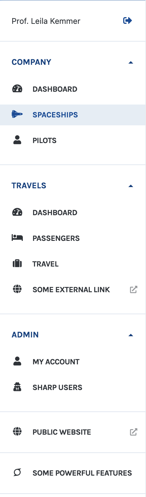

# Building the menu

The Sharp side menu can contain several links, organized as you want.

<div style="text-align: center">



</div>

All links shares common things:

- an icon (from [Font Awesome 5](https://fontawesome.com/icons/))
- a label
- and a URL

Links can be grouped in categories, like Company, Travels and Admin in this example.

## Create a SharpMenu class

### Write and declare the class

The class must extend `Code16\Sharp\Utils\Menu\SharpMenu`, and define a required `build()` method:

```php
class MySharpMenu extends Code16\Sharp\Utils\Menu\SharpMenu
{
    public function build(): self
    {
        // ...
    }
}
```

And should be declared in the config file:

```php
// sharp.php

[...]
'menu' => MySharpMenu::class
```

### Link to an entity list, a dashboard or to a single show

```php
class MySharpMenu extends Code16\Sharp\Utils\Menu\SharpMenu
{
    public function build(): self
    {
        return $this
            ->addEntityLink('person', 'People', 'fas fa-user')
            ->addEntityLink('feature', 'Features', 'fas fa-superpowers');
    }
}
```

Given that `feature` and 'person' should be entities defined in the config file. Sharp will create a link either to the Entity List, to the dashboard or to a [single Show Page](single-show.md) (depending on the entity configuration).

### Link to an external URL

```php
class MySharpMenu extends Code16\Sharp\Utils\Menu\SharpMenu
{
    public function build(): self
    {
        return $this->addExternalLink('https://google.com', 'Some external link', 'fas fa-globe');
    }
}
```

### Group links in sections

Sections are groups that can be collapsed

```php
class MySharpMenu extends Code16\Sharp\Utils\Menu\SharpMenu
{
    public function build(): self
    {
        return $this
            ->addSection('Admin', function(SharpMenuItemSection $section) {
                $section
                    ->addEntityLink('account', 'My account', 'fas fa-user')
                    ->addEntityLink('user', 'Sharp users', 'fas fa-user-secret');
            });
    }
}
```

### Add separators in sections

You can add a simple labelled separator in sections:

```php
class MySharpMenu extends Code16\Sharp\Utils\Menu\SharpMenu
{
    public function build(): self
    {
        return $this
            ->addSection('Admin', function(SharpMenuItemSection $section) {
                $section
                    ->addEntityLink('account', 'My account', 'fas fa-user')
                    ->addSeparator('Other users')
                    ->addEntityLink('user', 'Sharp users', 'fas fa-user-secret');
            });
    }
}
```

### Set a section to be non-collapsible

A section is collapsible by default, but you may want to always show it to the user

```php
class MySharpMenu extends Code16\Sharp\Utils\Menu\SharpMenu
{
    public function build(): self
    {
        return $this
            ->addSection('Admin', function(SharpMenuItemSection $section) {
                $section
                    ->setCollapsible(false)
                    ->addEntityLink('account', 'My account', 'fas fa-user');
            });
    }
}
```

### Add links in the user (profile) menu

Next to user's name or email, Sharp displays a dropdown menu with a logout link. You can add your own links in this menu:

```php
class MySharpMenu extends Code16\Sharp\Utils\Menu\SharpMenu
{
    public function build(): self
    {
        return $this
            ->setUserMenu(function (SharpMenuUserMenu $menu) {
                $menu->addEntityLink('account', 'My account', 'fas fa-user');
            });
    }
}
```
