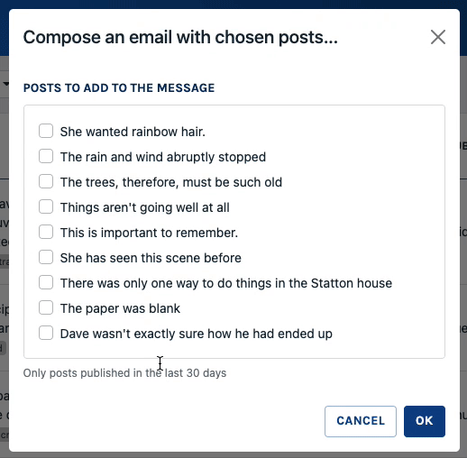

# Write a Wizard Command

A Wizard is a multistep Command. A common example would be a first step with a resource selection, and a second step with a message box, pre-filled with the previous selection.

In Sharp, Wizard are similar to Commands in many ways: they can be scoped to an instance or to an entity, and can be attached to an Entity List, a Show Page or a Dashboard.



## Write the Wizard Command class

The class must extend either: 
- `Code16\Sharp\EntityList\Commands\Wizards\EntityWizardCommand`: for an Entity command, on an Entity List
- `Code16\Sharp\EntityList\Commands\Wizards\InstanceWizardCommand`: for an Instance command, on an Entity List or a Show Page
- `Code16\Sharp\Dashboard\Commands\DashboardWizardCommand`: for a Dashboard Command

Like any Command, you must extend `label(): string` function, and can extend `buildCommandConfig(): void` (see [Commands documentation](commands.md)). 

## Implement the first step of the Wizard

Instead of `execute()`, you must implement `executeFirstStep(array $data): array`, or `executeFirstStep(mixed $instanceId, array $data): array` in an instance case. This method, as expected, must contain the execution code of your first step:

```php
public function executeFirstStep(array $data): array
{
    // Do something
}
```

You must also implement `protected function buildFormFieldsForFirstStep(FieldsContainer $formFields): void`, to build the first step's form:

### Add a form for the first step

Wizard Commands needs forms, one for each step. To build the forms, we use the same API as usual (see [Commands documentation](commands.md)), the only difference is where to put the code. For the first step, you already have the answer, it's in `buildFormFieldsForFirstStep`:

```php
public function buildFormFieldsForFirstStep(FieldsContainer $formFields): void
{
    $formFields->addField(
        SharpFormSelectField::make('posts', Post::pluck("name", "id")->toArray())
            ->setMultiple()
            ->setLabel('Posts to add to the message')
    );
}
```

Layout (if needed) can be defined in:

```php
protected function buildFormLayoutForFirstStep(FormLayoutColumn &$column): void
{
    // ...
}
```

And finally, to set initial data for the form, you might implement:

```php
protected function initialDataForFirstStep(): array
{
    return ['name' => 'Bob'];
}
```

### Link a step to another one

To tell Sharp to go to the next step, Wizard commands expose a new `toStep(string $step)` action, which expects a string key representing you step: 

```php
public function executeFirstStep(array $data): array
{
    // Do something
    return $this->toStep('compose-message');
}
```

This string key must be "sluggable": only chars, carets and underscores.

## Implement further steps

### Add a form to each step

There is two options:

#### First option: one method for all

If your Wizard is small, this could be the right way to proceed. Simply extend the `buildFormFieldsForStep(string $step, FieldsContainer $formFields): void` method, with a test on `$step`: 

```php
protected function buildFormFieldsForStep(string $step, FieldsContainer $formFields): void
{
    if ($step === 'compose-message') {
        $formFields->addField(
              SharpFormTextareaField::make('message')
                  ->setLabel('Message text')
                  ->setRowCount(8),
          );
    } elseif ($step === 'my-other-step') {
        // ...
    }
}
```

#### Second option: one method per step

This should be a better option in many cases, to clarify things in the Wizard class; you can define a `buildFormFieldsForStepXXX(FieldsContainer $formFields): void`, where `XXX` is the camel cased name of you step. So in our example:

```php
public function buildFormFieldsForStepComposeMessage(FieldsContainer $formFields): void
{
    $formFields
        ->addField(
            SharpFormTextareaField::make('message')
                ->setLabel('Message text')
                ->setRowCount(8),
        );
}
```

### Define form layouts (if needed)

By default, fields will appear in the order of declaration, like for a regular Command. In case you need more control, you might want to define a layout; once again, you can use one global method:

```php
protected function buildFormLayoutForStep(string $step, FormLayoutColumn &$column): void
{
    // ...
}
```

... or define one per step:

```php
protected function buildFormLayoutForStepComposeMessage(FormLayoutColumn &$column): void
{
    // ...
}
```

### Initialize form data

You will start to notice a pattern; one method for all:

```php
protected function initialDataForStep(string $step): array
{
    // ...
}
```

or one method per step:

```php
protected function initialDataForStepComposeMessage(): array
{
    // ...
}
```

In the Instance case, methods have an `$instanceId` param: `initialDataForFirstStep(mixed $instanceId): array` and `initialDataForStep(string $step, mixed $instanceId): array`.

### Write the execution code of each step

Very much like first step, you must define the execution code of each step. And like form declaration, this could be done either in one method, or in one by step:

#### One method for all

Entity and Dashboard case:

```php
public function executeStep(string $step, array $data = []): array
{
    if ($step === 'compose-message') {
        return $this->toStep('checkout');
    } else {
        // ...
    }
}
```

Instance case:

```php
public function executeStep(string $step, mixed $instanceId, array $data = []): array
{
    // ...
}
```

#### One method per step

Similarly to forms and layouts; for Entity and Dashboard cases:

```php
public function executeStepComposeMessage(array $data = []): array
{
    // ...
}
```

Instance case:

```php
public function executeStepComposeMessage(mixed $instanceId, array $data = []): array
{
    // ...
}
```

### Validate posted data

Validation works the same as for regular Commands, with `$this->validate()`:

```php
public function executeStepComposeMessage(array $data = []): array
{
    $this->validate($data, ['message' => 'required']);
    // ...
}
```

## Link steps, terminate the Wizard

As seen before, Wizard commands provide a new `toStep(string $step)` action that can be returned in execution methods. 

An any point, if a step returns another action (`view`, `download`, `info`...), this will lead to terminate the Wizard. This means that steps are dynamically linked: you can finish after the first step if some data was entered, or link to another one in other cases.

If an exception is thrown (an in particular, a `SharpApplicativeException`), the Wizard is also stopped.

## Keep context between steps

This is a key part of Wizard commands: each step may need data from the previous one. To achieve this, you may use you regular storage (database) to store some state, but often it's better not to persist anything before the end of the Wizard. 

For this purpose, you have access to a shared context, maintained between each step, via `$this->getWizardContext()`. You can:

- store a value: `$this->getWizardContext()->put('name', 'value')` (typically, in the `execute()` method)
- retrieve a value: `$this->getWizardContext()->get('name')` (in the `initialData()` method)
- validate a stored value: `$this->getWizardContext()->validate('name', $rules)` (in the `initialData()` method)

Consider the following example, taken (and simplified) from the Sharp Demo:

First we build and execute the first step; in the process, we save the select post ids in the context:

```php
public function buildFormFieldsForFirstStep(FieldsContainer $formFields): void
{
    $formFields->addField(
        SharpFormSelectField::make('posts', Post::pluck('name', 'id')->toArray())
            ->setMultiple()
            ->setLabel('Posts to add to the message')
    );
}

public function executeFirstStep(array $data = []): array
{
    $this->validate($data, ['posts' => 'required']);
    $this->getWizardContext()->put('posts', $data['posts']);

    return $this->toStep('compose_message');
}
```

For the `compose_message` step, we initialize data based on what is in the context, after validating that te context has post ids (to ensure we are coming from step 1):

```php
protected function initialDataForStepComposeMessage(): array
{
    $this->getWizardContext()->validate(['posts' => 'required']);

    return [
        'message' => collect(
            ['Here’s a list of posts I think you may like:'])
            ->merge(
                Post::whereIn('id', $this->getWizardContext()->get('posts'))
                    ->get()
                    ->pluck('title')
            )
            ->implode("\n"),
    ];
}
```

We build the form, and store a result useful for the next step in the context (and so on, until the end):

```php
public function buildFormFieldsForStepComposeMessage(FieldsContainer $formFields): void
{
    $formFields->addField(
        SharpFormTextareaField::make('message')->setLabel('Message text')
    );
}

public function executeStepComposeMessage(array $data = []): array
{
    $this->validate($data, ['message' => 'required']);
    $this->getWizardContext()->put('message', $data['message']);

    return $this->toStep('choose_recipients');
}
```

## Tip: compose the code

Sharp forces you to define the whole Wizard, with all its steps, in a single Command class. This is wanted, since the Command still has only one label, config, authorization... and is seen as a single process, as it should be. But it can lead to a big file with many rows; for this, there is a simple solution provided by PHP: using traits, one per step. 

Maybe something like this, where each trait contains step related methods (`initialData`, `buildFormField`, `buildFormLayout`, `execute`):

```php
class SendEmailWithPostsWizardCommand extends EntityWizardCommand
{
    use SendEmailStepChoosePosts, 
        SendEmailStepComposeMessage, 
        SendEmailStepSelectRecipients;

    public function label(): ?string
    {
        return 'Compose an email with chosen posts...';
    }

    public function authorize(): bool
    {
        return auth()->user()->hasRole('admin');
    }
}
```