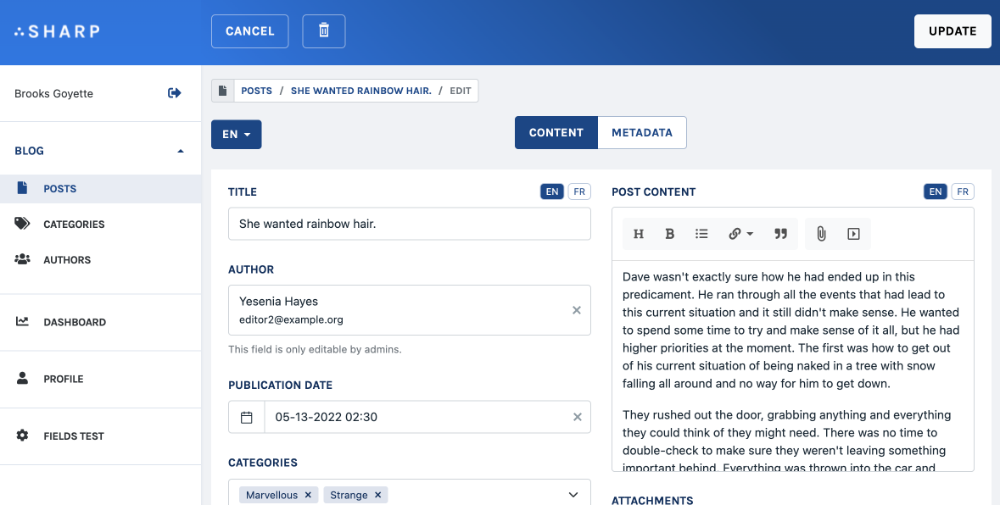

# Data localization in Forms and Shows

Sharp can help in data localization handling, both in the Form and in the Show. But first, let's mention that it could be perfectly fine to handle data localization with a `locale` field in a Model, and a [List Filter](filters.md): we can call this a full separated localization strategy, where each instance is in one locale only.

This chapter is about another strategy, where a `Book` can have English and French title and summary, but a common author name and cover picture.


## Configure the Form

First, define which locales the Form should handle:

```php
class SpaceshipSharpForm extends SharpForm
{
    [...]

    function getDataLocalizations()
    {
        return ["fr", "en"];
    }
}
```

## Configure the form fields

Next, each localized field must be marked, using `setLocalized()`:

```php
function buildFormFields()
{
    $this->addField(
        SharpFormTextField::make("title")
            ->setLocalized()
            ->setLabel("Name")
}
```

Once one field at least is localized, here's what appears on the front side:

)

A global locale selector is added, as well as individual ones on each localized field.

## Transform the data accordingly

### General approach

Sharp is expecting, for localized fields, a key / value array where the locales are keys. Here's a example of how it could be achieved:

```php
function find($id): array
{
    return $this->setCustomTransformer("title", function($title, $book) {
            return [
               "fr" => $book->title_french,
               "en" => $book->title_english
            ];
        })
        ->transform(
            Book::findOrFail($id)
        );
}
```

The `update()` method should of course be updated too:

```php
function update($id, array $data)
{
    $instance = $id ? Book::findOrFail($id) : new Book;

    $data["title_french"] = $data["title"]["fr"];
    $data["title_english"] = $data["title"]["en"];

    $this
        ->ignore("title")
        ->save($instance, $data);

    return $instance->id;
}
```

As you see here, Sharp data structure for localized values is the name of the field suffixed with a dot and the locale. So if `title` is a localized field, and "en" and "fr" locales are configured for the Form, Sharp will expect `title` to be an key / value array with the locales as keys, and will send it back in the `update()` method with this same format.

### Using this format as data structure

This data structure is in fact pretty common for localization in the database structure, using JSON-based fields. Spatie's popular [laravel-translatable](https://github.com/spatie/laravel-translatable) package is using it, for instance. With this package, here's how our `Book` Model can be written:

```php
class Book extends Model
{
    use Spatie\Translatable\HasTranslations;

    public $translatable = ['title'];

    [...]
}
```

And since the package, like other, is using this array with locales convention, it should work right away, without any tricks in the Sharp Form:

```php
function find($id): array
{
    return $this->transform(Book::findOrFail($id));
}

function update($id, array $data)
{
    $instance = $id ? Book::findOrFail($id) : new Book;
    $this->save($instance, $data);

    return $instance->id;
}
```

## Validation

Validation allows differentiating rules between locales:

```php
public function rules()
{
    return [
        'title.fr' => 'required',
    ];
}
```

## Display locales on the Show

First, like expressed before, a solution could be to display both versions for each localized field, mentioning the locale in the field label:

)

But you can also let Sharp display a locale selector, by configuring locales, defining which fields are localized, and transforming data accordingly, very much like for the Form (see above):

```php
protected function buildShowFields(FieldsContainer $showFields): void
{
    $showFields->addField(
        SharpShowTextField::make('title')
            ->setLabel('Title')
            ->setLocalized()
    );
}

[...]

public function getDataLocalizations(): array
{
    return ['en', 'fr'];
}
```
