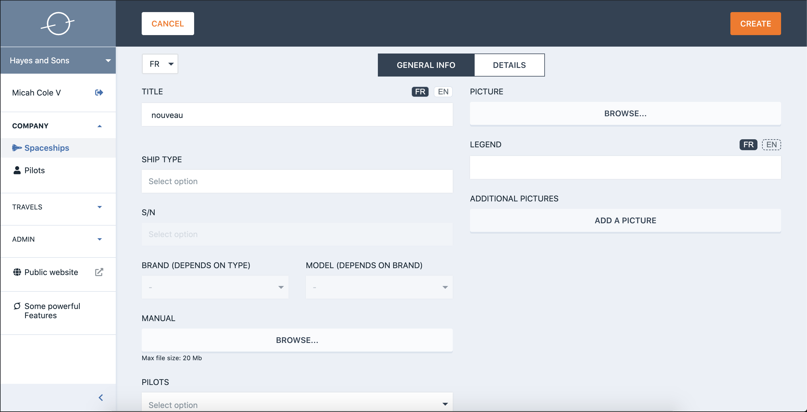

# Form data localization

Sharp can help in data localization handling. But first, let's start mentionning that it could be perfectly fine to handle data localization with a `locale` field in a Model, and a [List Filter](filters.md): we can call this a full separated localization strategy, where each instance is in one locale only.

This chapter is about another strategy, where a `Book` can have English and French title and summary, but a common author name and cover picture.


## Configure the Form

First, define which locales the Form should handle:

```php
class SpaceshipSharpForm extends SharpForm
{
    [...]

    function getDataLocalizations()
    {
        return ["fr", "en"];
    }
}
```


## Configure the form fields

Next, each localized field must be marqued, using `setLocalized()`:

```php
function buildFormFields()
{
    $this->addField(
        SharpFormTextField::make("title")
            ->setLocalized()
            ->setLabel("Name")
}
```

## Transform the data accordingly

### General approach

Sharp is expecting, for localized fields, a key / value array where the locales are keys. Here's a example of how it could be achieved:

```php
function find($id): array
{
    return $this->setCustomTransformer("title", function($title, $book) {
            return [
               "fr" => $book->title_french,
               "en" => $book->title_english
            ];
        })
        ->transform(
            Book::findOrFail($id)
        );
}
```


The `update()` method should of course be updated too:

```php
function update($id, array $data)
{
    $instance = $id ? Book::findOrFail($id) : new Book;

    $data["title_french"] = $data["title"]["fr"];
    $data["title_english"] = $data["title"]["en"];

    $this
        ->ignore("title")
        ->save($instance, $data);

    return $instance->id;
}
```

As you see here, Sharp data structure for localized values is the name of the field suffixed with a dot and the locale. So if `title` is a localized field, and "en" and "fr" locales are configured for the Form, Sharp will expect `title` to be an key / value array with the locales as keys, and will send it back in the `update()` method with this same format.

### Using this format as data structure

This data structure is in fact pretty common for localization in the database structure, using JSON-based fields. Spatie's popular [laravel-translatable](https://github.com/spatie/laravel-translatable) package is using it, for instance. With this package, here's how our `Book` Model can be written:

```php
class Book extends Model
{
    use Spatie\Translatable\HasTranslations;

    public $translatable = ['title'];

    [...]
}
```

And since the package, like other, is using this array with locales convention, it should work right away, without any tricks in the Sharp Form:


```php
function find($id): array
{
    return $this->transform(Book::findOrFail($id));
}


function update($id, array $data)
{
    $instance = $id ? Book::findOrFail($id) : new Book;

    $this->save($instance, $data);

    return $instance->id;
}
```

## Validation

Validation is not more complicated, and allows to differenciate rules between locales:

```php
public function rules()
{
    return [
        'title.fr' => 'required',
    ];
}
```


## The front side

On the front side of the Form, here's how localized fields are displayed:


