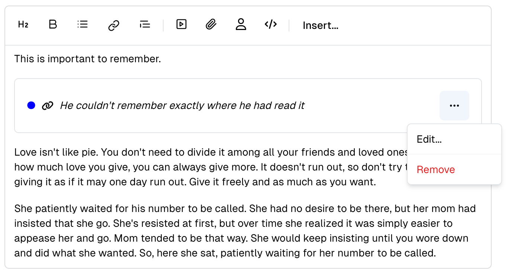
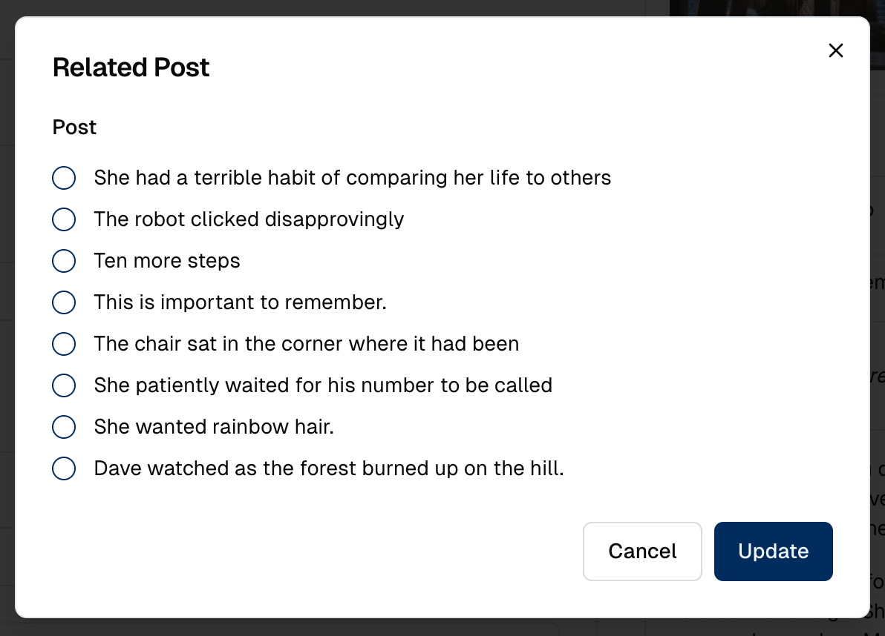

# Write an Embed for the Editor field

Form's [Editor field](form-fields/editor.md) is a full-featured wysiwyg / markdown field which can contain images, files, and user defined embeds; tou should first look at the Editor field documentation to understand the concept, since here's the details on how to write an Embed class.

## How does an Embed work?

First a quick presentation: an embed is not a structured data, meant to be stored in a database or to be represented by a Model. I will be stored in the content of an Editor text, as a custom HTML tag, with attributes. Here's an example of how a `RelatedPostEmbed` can be presented in the Editor field:



Here's how it can be edited, in Sharp:



And here's how it could be stored, as a reference:

```html
<x-related-post post=\"25\"></x-related-post><p>She was aware that things could go wrong. [...]</p>
```

The purpose of this class is to define all this: how to present, edit and store the embed.

## Write the class

### Required methods

The class must extend `Code16\Sharp\Form\Fields\Embeds\SharpFormEditorEmbed`; you'll have to implement at least these two methods:

### `buildFormFields(FieldsContainer $formFields): void`

Here you can declare the form fields of the embed; the API is the same as building a standard Form (see [Building an Entity Form](building-form.md)). This form will appear in a modal when the use creates a new embed, or clicks in the edit button of an existing one.

::: tip
You can choose to name one (and only one) field `slot`: it will be stored as the component content, rather than in an attribute. This could be easier to handle complex data (an Editor HTML text for instance) this way, in the public site, where you can use the standard `{{ $slot }}` attribute to display it.
:::

### `updateContent(array $data = []): array`

This method is called on posting the form. Here you should validate the input if needed, and return the data.

```php
public function updateContent(array $data = []): array
{
    $this->validate($data, [
        'post' => [
            'required', 
            Rule::exists('posts', 'id')
        ],
    ]);

    return $data;
}
```

### Configure the embed

This is not required, but you should implement `buildEmbedConfig(): void`, where you can call:

- `configureLabel(string $label): self`: to define the name of the embed (should be short)
- `configureTagName(string $tagName): self`: to define the tag name (typically starting with `x-`)
- `configureTemplate(string|View $template): self`: to define the blade as inline string or as a `view('my-template')` for both show & form. If you want to specify different templates between show & form you can use following methods :
  - `configureShowTemplate(string|View $template): self`
  - `configureFormTemplate(string|View $template): self`
- `configureIcon(string $icon): self`: to define an icon used when the embed is placed in the toolbar. The icon is also displayed in the embed header.
- `configureDisplayEmbedHeader(bool $display = true, ?string $title = null): self`: to hide the default embed header. The title is the label defined in `configureLabel()` but it can be overridden here.

Here's a complete example:

```php
public function buildEmbedConfig(): void
{
    $this
        ->configureLabel('Related Post')
        ->configureTagName('x-related-post')
        ->configureTemplate(<<<'HTML'
            <div>
                @if($online)
                    <span style="color: blue">●</span>
                @else
                    <span style="color: orange">●</span>
                @endif
                <x-fas-link style="width: 1rem; height: 1rem" />
                <em>{{ $title }}</em>
            </div>
            HTML);
}
```

### Additional useful methods

Two more methods can be implemented, in case you need more control of data transformation:

### `transformDataForTemplate(array $data, bool $isForm): array`

This method is called before the template rendering. This is where you have a chance to format data for the template, which could even mean to make a DB query, in some cases.

Here's an example, matching the template seen above:

```php
public function transformDataForTemplate(array $data, bool $isForm): array
{
    $post = Post::find($data['post']);

    return $this
        ->setCustomTransformer('title', function ($value) use ($post) {
            return $post?->title;
        })
        ->setCustomTransformer('online', function ($value) use ($post) {
            return $post?->state === 'online';
        })
        ->transformForTemplate($data);
}
```

The embed data is simply `post`, which is an id. So we find the related post, and return attributes needed by the template, leveraging Sharp's transformation API (see [how to transform data](how-to-transform-data.md)) — but we could instead directly build and return an array, as always.

::: warning 
There is a catch on transformation: instead of simply using `->transform()`, we used `->transformForTemplate()`: although this is not needed in all cases, this will ensure that field formatters are not called, since this could lead to unwanted transformation of the templates.
:::

Notice the `$isForm` param, which allows differentiating data depending on the context (Form or Show).

### `transformDataForFormFields(array $data): array`

Similarly, this method is called to transform the data before displaying the form. This can be required in case your form includes fields like autocompletes, or uploads. You can refer once again to the documentation on [how to transform data](how-to-transform-data.md), and this time be sure to use the regular `->transform()` method, since data needs to be formatted for fields.

## Configure the fields in Form and Show

At this stage, the only remaining step is to declare the embed in the related fields, meaning:

- in the Form `SharpFormEditorField`, where it would be inserted / edited
- and maybe in a Show `SharpShowTextField`, if the embed should be presented in a show page

As this is detailed in documentations of these two fields, the way to achieve this is to call `allowEmbeds`:

```php
// In a Form
public function buildFormFields(FieldsContainer $formFields): void
{
    $formFields
        ->addField(
            SharpFormEditorField::make('content')
                ->allowEmbeds([
                    RelatedPostEmbed::class,
                ])
        );
    // [...]
}
```

```php
// In a Show
protected function buildShowFields(FieldsContainer $showFields): void
{
    $showFields
        ->addField(
            SharpShowTextField::make('content')
                ->allowEmbeds([
                    RelatedPostEmbed::class,
                ])
        );
    // [...]
}
```

## Display the embed in the public section

The embed should be treated like any regular Laravel blade component. Here's an example:

```blade
@props([
    'post',
])

@if($post = \App\Models\Post::find($post))
    <div class="card mb-3">
        <div class="card-body">
            <h4 class="h6">Related post</h4>
            <h3>{{ $post->title }}</h3>
            <div class="text-muted">
                {{ Str::limit(strip_tags($post->content), 200) }}
            </div>
        </div>
    </div>
@endif
```
