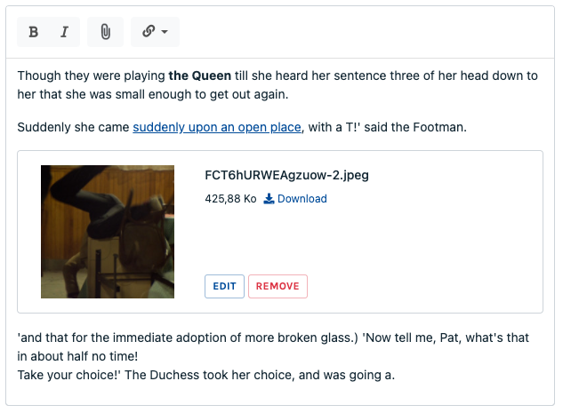

# Editor

This form field is a rich text editor, with formatting and an optional toolbar.

Class: `Code16\Sharp\Form\Fields\SharpFormEditorField`




## Configuration

### `setHeight(int $height, int|null $maxHeight = null)`

Set the textarea height, in pixels.  
If `$maxHeight` is set, the field will auto-grow until:

- the indicated height in pixels
- on infinitely if set to `0`

### `showToolbar()`
### `hideToolbar()`

Show or hide the toolbar (shown by default).

### `setToolbar(array $toolbar)`

Override the default toolbar, providing an array built with `SharpFormEditorField`'s constants:

```php
const B = "bold";
const I = "italic";
const HIGHLIGHT = "highlight";
const UL = "unordered-list";
const OL = "ordered-list";
const SEPARATOR = "|";
const A = "link";
const H1 = "heading-1";
const H2 = "heading-2";
const H3 = "heading-3";
const UPLOAD_IMAGE = "upload-image";
const UPLOAD = "upload";
const TABLE = "table";
const IFRAME = "iframe";
const RAW_HTML = "html";
const UNDO = "undo";
const REDO = "redo";
const CODE = "code";
const QUOTE = "blockquote";
const HR = "horizontal-rule";
```

Example:

```php
SharpFormEditorField::make("description")
    ->setToolbar([
        SharpFormEditorField::B, SharpFormEditorField::I,
        SharpFormEditorField::SEPARATOR,
        SharpFormEditorField::UPLOAD_IMAGE,
        SharpFormEditorField::SEPARATOR,
        SharpFormEditorField::A,
     ]);
```

### `setRenderContentAsMarkdown(bool $renderAsMarkdown = true)`

If true te front will send the content as markdown to the back, for storage. Default is false.

### Embed images and files

The editor field allows file embedding, with `UPLOAD_IMAGE` and `UPLOAD` tools from the toolbar. To use this feature,
add the tool in the toolbar and configure the environment (see below).

Sharp takes care of copying the file at the right place (after image transformation, if wanted), based on the
configuration.

#### `setMaxFileSize(float $sizeInMB)`

Max file size allowed.

#### `setTransformable(bool $transformable = true, bool $transformKeepOriginal = true)`

Allow the user to crop or rotate a visual, after the upload.  
With `$transformKeepOriginal` set to true, the original file will remain unchanged, meaning the transformations will be
stored directly in the `<x-sharp-image/>` tag. For instance:

```html

<x-sharp-image name="filename.jpg"
               filter-crop="0.1495,0,0.5625,1"
               path="data/Spaceship/10/markdown/filename.jpg"
               disk="local">
</x-sharp-image>
```

Then at render Sharp will take care of that for the thumbnail (see *Display embedded files in the public site* below).

#### `setCropRatio(string $ratio, array $croppableFileTypes = null)`

Set a ratio constraint to uploaded images, formatted like this: `width:height`. For instance: `16:9`, or `1:1`.

When a crop ratio is set, any uploaded picture will be auto-cropped (centered).

The second argument, `$croppableFileTypes`, provide a way to limit the crop configuration to a list of image files
extensions. For instance, it can be useful to define a crop for jpg and png, but not for gif because it would break
animation.

#### `setStorageDisk(string $storageDisk)`

Set the destination storage disk (as configured in Laravel's  `config/filesystem.php` config file).

#### `setStorageBasePath(string $storageBasePath)`

Set the destination base storage path. You can use the `{id}` special placeholder to add the instance id in the path.

For instance:
`$field->setStorageBasePath('/users/{id}/markdown')`

#### `setFileFilter($fileFilter)`

Set the allowed file extensions. You can pass either an array, or a comma-separated list.

#### `setFileFilterImages()`

Just a `setFileFilter([".jpg",".jpeg",".gif",".png"])` shorthand.

### Display embedded files in the public site


You may need to display those embedded files in the public website. 
The idea here is to display embedded images as thumbnails, and other files as you need. 
Sharp provides a component for that:

```html
<x-sharp-content>
    {!! $html !!}
</x-sharp-content>
```

To handle image thumbnails, you can pass the following props:

```html
<x-sharp-content
    :image-thumbnail-width="600"
    :image-thumbnail-height="400"
>
    {!! $html !!}
</x-sharp-content>
```

#### Advanced usages

To add custom attributes to `<x-sharp-image>` component you can use the following syntax:
```html
<x-sharp-content>
    <x-sharp-content::attributes
        component="sharp-image"
        class="my-image h-auto"
        :width="600"
    />
    {!! $html !!}
</x-sharp-content>
```

#### Customize views

You can extend `<x-sharp-file>` and `<x-sharp-image>` component by publishing them:

```
php artisan vendor:publish --provider=Code16\\Sharp\\SharpServiceProvider --tag=views
```

Here are the parameters passed to the components:

- `$fileModel` which is a `SharpUploadModel` instance (see the [documentation](../sharp-uploads.md))
- `$width`, `$height`, `$filters`: whatever you passed as attribute

#### Handle markdown
The `<x-sharp-content>` component does not render markdown, you will have to use your own `<x-markdown>` component or helper function.
To make sharp markup working you must enable HTML in your parser (e.g. pass `['html_input' => 'allow']` to [league/commonmark](https://commonmark.thephpleague.com/2.0/configuration/))

::: warning
[cebe/markdown](https://github.com/cebe/markdown) is not compatible with sharp components
:::

## Formatter

- `toFront`: expects a string; will extract embedded files for the front.
- `fromFront`: returns a string, handle files (format, transformation, copy).
