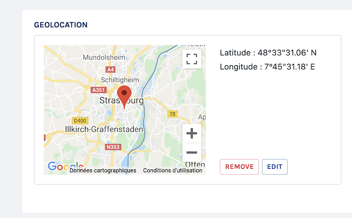
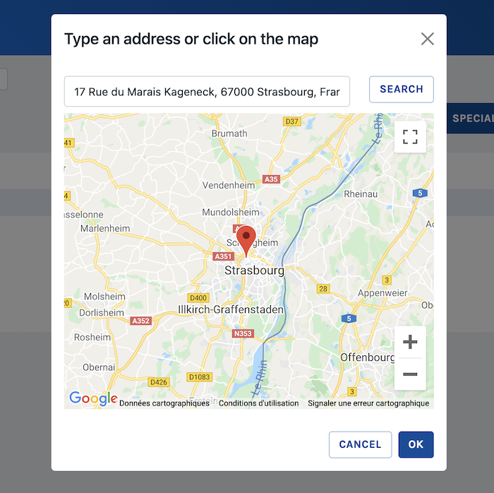

# Geolocation

A map-based field to pick a precise location and return its coordinates (latitude and longitude)

Class: `Code16\Sharp\Form\Fields\SharpFormGeolocationField`

<table>
<tr>
<td class="p-0">

</td>
<td class="p-0">

</td>
</tr>
</table>

## Configuration

### `setDisplayUnitDegreesMinutesSeconds()`

Sets the coordinate display to be degrees-minutes-second, eg: `17°10'16'', 89°17'45''`

### `setDisplayUnitDecimalDegrees()`

Sets the coordinate display to be decimal degrees, eg:
`0.36666667, 17.15722222`.
This is the default.

### `setInitialPosition(float $lat, float $lng)`
### `clearInitialPosition()`

Sets the initial position of the edit map, when there in no marker yet.

### `setBoundaries(float $northEastLat, float $northEastLng, float $southWestLat, float $southWestLng)`
### `clearBoundaries()`

If needed, set boundaries to the edit map, providing a north-east and a south-west position.

### `setZoomLevel(int $zoomLevel)`

Set the map zoom level, from 1 (the World) ou 25. Default is 10.

### `setMapsProvider(string $provider, array $options = [])`

You can choose between 2 providers for the Maps display:
- "gmaps" for Google Maps (requires an API key, see below)
- "osm" for Open Street Maps

### `setGeocoding(bool $geocoding = true)`

Authorize geocoding, meaning enter an address and get back the coordinates.
Default is false. May require an API key depending on the provider (see below).

### `setGeocodingProvider(string $provider, array $options = [])`

You can choose between 2 providers for geocoding:
- "gmaps" for Google Maps (requires an API key, see below)
- "osm" for Open Street Maps ([Nominatim](https://nominatim.openstreetmap.org))

### `setApiKey(string $apiKey)`

If you use Google Maps as provider, for maps ou geocoding, you'll need a valid Google Maps Api key.
This method will set the API key for both maps and geocoding.

### `setGeocodingApiKey(string $apiKey)`

This method will set the API key for geocoding only.

### `setMapsApiKey(string $apiKey)`

This method will set the API key for maps only.

## Formatter

- `toFront`: expects a string with comma-separated decimal degrees  values (`0.36666667,17.15722222` for instance).
- `fromFront`: returns a string with the same format than `toFront`.
