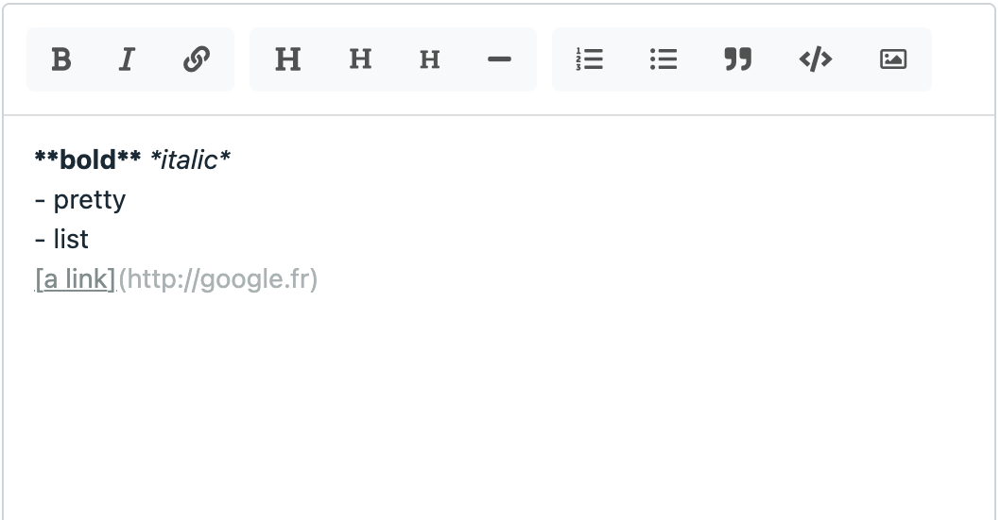

# Markdown

This form field is a markdown editor, with formatting and an optional toolbar.

Class: `Code16\Sharp\Form\Fields\SharpFormMarkdownField`




## Configuration


### `setHeight(int $height)`

Set the textarea height, in pixels.

### `showToolbar()`
### `hideToolbar()`

Show or hide the toolbar (shown by default).

### `setToolbar(array $toolbar)`

Override the default toolbar, providing an array built with `SharpFormMarkdownField`'s constants:

```php
const B = "bold";
const I = "italic";
const UL = "unordered-list";
const OL = "ordered-list";
const SEPARATOR = "|";
const A = "link";
const H1 = "heading-1";
const H2 = "heading-2";
const H3 = "heading-3";
const CODE = "code";
const QUOTE = "quote";
const DOC = "document"; // special, see below
const HR = "horizontal-rule";
```

Example:

```php
SharpFormMarkdownField::make("description")
    ->setToolbar([
        SharpFormMarkdownField::B, SharpFormMarkdownField::I,
        SharpFormMarkdownField::SEPARATOR,
        SharpFormMarkdownField::DOC,
        SharpFormMarkdownField::SEPARATOR,
        SharpFormMarkdownField::A,
     ]);
```

### Embed images and files in markdown

The markdown field allows file embedding, with the `DOC` tool (from the toolbar). To use this feature, add the tool in the toolbar and configure the environment (see below).

Sharp takes care of copying the file at the right place (after image transformation, if wanted), based on the configuration.

#### `setMaxFileSize(float $sizeInMB)`

Max file size allowed.

#### `setCropRatio(string $ratio, array $croppableFileTypes = null)`

Set a ratio constraint to uploaded images, formatted like this: `width:height`. For instance: `16:9`, or `1:1`.

When a crop ratio is set, any uploaded picture will be auto-cropped (centered).

The second argument, `$croppableFileTypes`, provide a way to limit the crop configuration to a list of image files extensions. For instance, it can be useful to define a crop for jpg and png, but not for gif because it would break animation.

#### `setStorageDisk(string $storageDisk)`

Set the destination storage disk (as configured in Laravel's  `config/filesystem.php` config file).

#### `setStorageBasePath(string $storageBasePath)`

Set the destination base storage path. You can use the `{id}` special placeholder to add the instance id in the path.

For instance:
`$field->setStorageBasePath('/users/{id}/markdown')`

#### `setFileFilter($fileFilter)`

Set the allowed file extensions. You can pass either an array, or a comma-separated list.

#### `setFileFilterImages()`

Just a `setFileFilter([".jpg",".jpeg",".gif",".png"])` shorthand.

### Display embedded files in the public site

You may need to display those embedded files in the public website. The idea here is to display embedded images as thumbnails, and other files as you need. Sharp provides a helper for that:

`sharp_markdown_embedded_files(string $html, string $classNames, int $width = null, int $height = null, array $filters = [])`

Where:

- `$html` is the html-parsed markdown. Note that Sharp includes a markdown parser, [Parsedown](https://github.com/erusev/parsedown), but you are free to choose yours.
- `$classNames` will be set a `class` on the `` or `<div>` tag.
  
And for images only:
- `$width` and `$height` are constraints for the thumbnail.
- `$filters` [described in this documentation](../sharp-built-in-solution-for-uploads.md).

This helper will make use of a special view, `public.markdown-embedded-file.blade.php`, for the render part. You can extend this view publishing it:

```
    php artisan vendor:publish --provider=Code16\\Sharp\\SharpServiceProvider --tag=views
```

Here are the parameters passed to the view:
- `$fileModel` which is a `SharpUploadModel` instance (see the [documentation](../sharp-built-in-solution-for-uploads.md))
- `$isImage` (bool)
- `$classNames`, `$width`, `$height`, `$filters`: whatever you passed to the helper function

::: warning
In order to make this parsing work, you have to ensure that embedded images and files are in a dedicated paragraph. This means, as we're using the Markdown norm here, that a file should have a blank row before and one after, in the text. Sharp's Markdown filed will take care of that, by default, in its formatter. 
:::

## Formatter

- `toFront`: expects a markdown string; will extract embedded files for the front.
- `fromFront`: returns a markdown string, handle files (format, transformation, copy).
