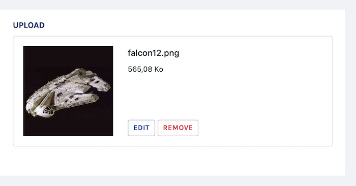

# Upload

Class: `Code16\Sharp\Form\Fields\SharpFormUploadField`



## General configuration

First, in order to get the upload part working, you have to define a "tmp" path where files will be stored until they are moved to the final folder. Here's the default:

```php
// in config/sharp.php

"uploads" => [
    "tmp_dir" => env("SHARP_UPLOADS_TMP_DIR", "tmp"),
]
```

This `tmp_dir` path is relative to the `local` filesystem defined in the Laravel configuration.


## Field Configuration

### `setMaxFileSize(float $sizeInMB)`

Max file size allowed.

### `setTransformable(bool $transformable = true, ?bool $transformKeepOriginal = null)`

Allow the user to crop or rotate the visual, after the upload.  
The argument `$transformKeepOriginal` overrides the following config which is `true` by default.
```php
// config/sharp.php

"uploads" => [
    'transform_keep_original_image' => true,
]
```
With `$transformKeepOriginal` set to true, the original file will remain unchanged, meaning the transformations will be
stored apart: using the [built-in way to handle uploads](../sharp-uploads.md), it's transparent. Otherwise, see the
Formatter part below.

### `setCropRatio(string $ratio, array $croppableFileTypes = null)`

Set a ratio constraint to uploaded images, formatted like this: `width:height`. For instance: `16:9`, or `1:1`.

When a crop ratio is set, any uploaded picture will be auto-cropped (centered).

The second argument, `$croppableFileTypes`, provide a way to limit the crop configuration to a list of image files extensions. For instance, it can be useful to define a crop for jpg and png, but not for gif because it will destroy animation.

### `setStorageDisk(string $storageDisk)`

Set the destination storage disk (as configured in Laravel's  `config/filesystem.php` config file).

### `setStorageBasePath(string|Closure $storageBasePath)`

Set the destination base storage path. 

You can use the `{id}` special placeholder to add the instance id in the path, which can be useful sometimes; **be sure to read the "Delayed creation" section, at the end of this page if you do.**

For instance:
`$field->setStorageBasePath('/users/{id}/avatar')`

### `setFileFilter($fileFilter)`

Set the allowed file extensions. You can pass either an array or a comma-separated list.

### `setFileFilterImages()`

Just a `setFileFilter([".jpg",".jpeg",".gif",".png"])` shorthand.

### `setCompactThumbnail(bool $compactThumbnail = true)`

If true and if the upload has a thumbnail, it is limited to 60px high (to compact in a list item, for instance).

### `shouldOptimizeImage(bool $shouldOptimizeImage = true)`

If true, some optimization will be applied on the uploaded images (in order to reduce files weight). It relies on
spatie's [image-optimizer](https://github.com/spatie/image-optimizer). Please note that you will need some of these
packages on your system:
- [JpegOptim](http://freecode.com/projects/jpegoptim)
- [Optipng](http://optipng.sourceforge.net/)
- [Pngquant 2](https://pngquant.org/)
- [SVGO](https://github.com/svg/svgo)
- [Gifsicle](http://www.lcdf.org/gifsicle/)
- [cwebp](https://developers.google.com/speed/webp/docs/precompiled)

Check their documentation for [more instructions](https://github.com/spatie/image-optimizer#optimization-tools) on how to install.

## Formatter

First, let's mention that Sharp provides an Eloquent built-in solution for uploads with the `SharpUploadModel` class,
as [detailed here](../sharp-uploads.md), which greatly simplify the work (to be clear: it will handle everything from
storage to image transformations).

Here's the documentation for the **not built-in solution**:

### `toFront`

The front expects an array with these keys:

```php
[
    "name" => "", // The file name
    "path" => "", // Relative file path
    "disk" => "", // Storage disk name
    "thumbnail" => "", // URL of the thumbnail (if image, obviously)
    "size" => x, // Size in bytes
    "filters" => [ // Transformations applied to the (image) file
        "crop" => [
            "x" => x,
            "y" => y,
            "width" => w,
            "height" => h,
        ],
        "rotate" => [
            "angle" => a,
        ]
    ]
]
```

The formatter can't handle it automatically, it too project-specific. You'll have to provide this in a custom transformer ([see full documentation](../how-to-transform-data.md)) like this:

```php
function find($id): array
{
    return $this
        ->setCustomTransformer("picture",
            function($value, $spaceship, $attribute) {
                return [
                    "name" => basename($spaceship->picture->name),
                    "path" => $spaceship->picture->name,
                    "disk" => "s3",
                    "thumbnail" => [...],
                    "size" => $spaceship->picture->size,
                    "filters" => $spaceship->picture->filters
                ];
            }
        )
        ->transform(
            Spaceship::findOrFail($id)
        );
}
```

Do note that the thumbnail should comply to following rules: be at least 200x200 pixels, and more importantly it must apply the transformations defined by the filters if there is some. 

### `fromFront`

There are four cases:

#### newly uploaded file

The formatter will store the file on the configured location, and return an array like this:

```php
[
    "file_name" => "", // Relative file path
    "size" => x, // File size in bytes
    "mime_type" => "", // File mime type
    "disk" => "", // Storage disk name
    "filters" => [ // Transformations applied to the (image) file
        "crop" => [
            "x" => x,
            "y" => y,
            "width" => w,
            "height" => h,
        ],
        "rotate" => [
            "angle" => a,
        ]
    ]
];
```

It's up to you then to store any of these values in a DB or elsewhere.

Using the `Code16\Sharp\Form\Eloquent\WithSharpFormEloquentUpdater`, you will probably reach a solution like this:

```php
function update($id, array $data)
{
    $instance = $id ? Spaceship::findOrFail($id) : new Spaceship;

    $this->ignore("picture")->save($instance, $data);

    // Then handle $data["picture"] here
}
```

#### existing transformed file

In this case, the file was already stored in a previous post, and was then transformed (cropped, or rotated). The formatter will simply return and array with one `filters` key:

```php
[
    "filters" => [
        "crop" => [
            "x" => x,
            "y" => y,
            "width" => w,
            "height" => h,
        ],
        "rotate" => [
            "angle" => a,
        ]
    ]
];
```

Then you'll have to catch and store that if needed.

#### deleted file

The formatter will return `null` (note that the file **will not** be deleted from the storage).

#### existing and unchanged file

The formatter will return **an empty array**.

## Delayed creation

As described in the `setStorageBasePath()` section of this document, you can configure the file storage path with an `{id}` placeholder, meaning that `/users/{id}/avatar` will be converted (by the field formatter) in `/users/1/avatar` for instance. 

But in order to do this in a creation case, when there is no id yet, Sharp will need your instance to be stored first. To do so, the `update()` method of your Form will be called twice:

- one first time without any upload which needs the `{id}`,
- and one second time only with these fields, using the new id returned by `update()`.

This is usually OK, but in some cases this could lead to unexpected errors. Consider this code taken from Saturn (Sharp's demo project) where we handle Spaceships with a visual configured with an `{id}` placeholder in its path: 

```php
// in SpaceshipForm.php
function update($id, array $data)
{
    $instance = $id ? Spaceship::findOrFail($id) : new Spaceship();

    $this->save($instance, $data);

    if(($data["capacity"]) >= 1000) {
        $this->notify("this is a huge spaceship, by the way!");
    }

    return $instance->id;
}
```
Here we're using the `notify()` feature to display a message back to the user, and it's working, excepted in one case: on a Spaceship creation with a visual, Sharp will delay the upload handling and call this method twice. On the second pass (for the upload), PHP will crash on the `if(($data["capacity"]) >= 1000)` row because `$data["capacity"]` is not set (only the upload field would be set on this second pass). This has to be addressed, and a working solution could be to replace this line with:

```php
if(($data["capacity"] ?? 0) >= 1000) {
    [...]
}
```
