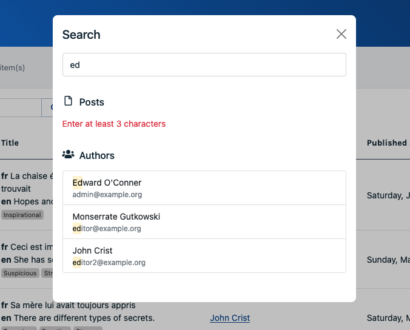

# Implement global search

This feature allows the user to globally search across a selected set of entities of your application.



## Configuration

```php
// In config/sharp.php
return [
   // ...
   'search' => [
      'enabled' => true,
      'placeholder' => 'Search for anything...',
      'engine' => \App\Sharp\MySearchEngine::class,
   ],
];
```

## Write the class

The search engine class must extend `Code16\Sharp\Search\SharpSearchEngine`, which would imply to implement the `searchFor(array $terms): void` method; here’s an example:

```php
class MySearchEngine extends SharpSearchEngine
{
    public function searchFor(array $terms): void
    {
        $resultSet = $this
            ->addResultSet(
                label: 'Posts',
                icon: 'fa-file-o',
            );

        $builder = Post::query();

        foreach ($terms as $term) {
            $builder->where('title', 'like', $term);
        }

        $builder
            ->limit(10)
            ->get()
            ->each(function (Post $post) use ($resultSet) {
                $resultSet->addResultLink(
                    link: LinkToShowPage::make('posts', $post->id),
                    label: $post->title,
                    detail: $post->author->name,
                );
            });
    }
}
```

This code manipulates `Code16\Sharp\Search\SearchResultSet` objects, which are used to group results by entity type (meaning: you may add several result sets). Here’s a list of methods exposed by this object:

- `addResultLink(SharpLinkTo $link, string $label, ?string $detail = null): ResultLink`: add a result in the set, providing a `SharpLinkTo` object (see [documentation](link-to.md)).
- `hideWhenEmpty(bool $hideWhenEmpty = true): self`: hide the result set if it’s empty (default is false).
- `setEmptyStateLabel(string $emptyStateLabel): self`: override the default empty state label (not used if `hideWhenEmpty()` is true).
- `validateSearch(array $rules, array $messages = []): bool`: handle validation, see below.

::: tip
In the very likely case you need to query multiple models, write a separate method for each of them (`searchForPosts($terms)`, `searchForOrders($terms)`...), and call them from the `searchFor()` method.
:::

### Validate search terms

You may need to validate whatever was typed by the user in the search field. Sharp allow to do so in each result set independently, for convenience:

```php
class MySearchEngine extends SharpSearchEngine
{
    public function searchFor(array $terms): void
    {
        $resultSet = $this
            ->addResultSet(
                label: 'Posts',
                icon: 'fa-file-o',
            );
            
      if (! $resultSet->validateSearch(
          ['string', 'min:3'], 
          ['min' => 'Please type at least 3 characters']
      )) {
          // No need to query the DB
          return;
      }
            
      // Search terms are valid, proceed with query
      // ...
    }
}
```

As you can see in this example, the `validateSearch()` method accepts an array of regular Laravel validation rules, and an optional array of custom validation messages. Sharp will not display results if the validation fails, but a good practice is to return early in this case, to avoid unnecessary queries.

## Use the search field

The search field is available in the top bar of Sharp, and can be called with these pretty standard keyboard shortcuts: `Ctrl+K`, `Cmd+K` (Mac) or simply `/`.