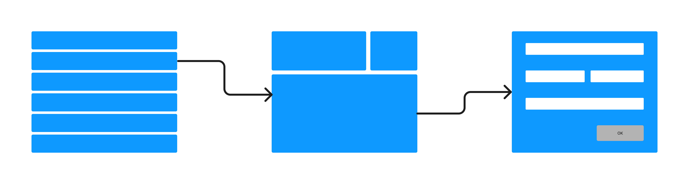
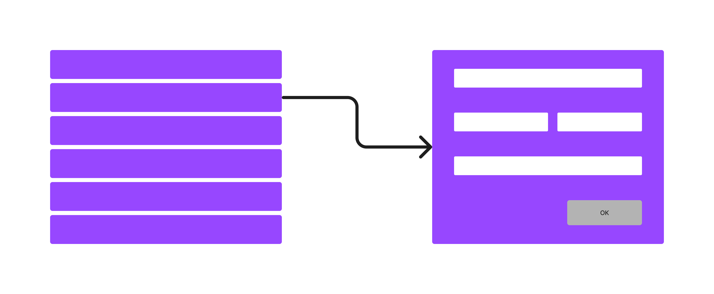
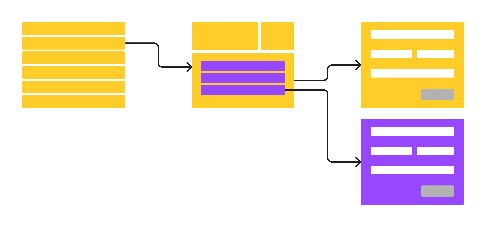

# Getting started and installation

## Terminology, general concept

In Sharp, we handle `entities`; an `entity` is simply a data structure which has a meaning in the application context. For instance, a `Person`, a `Post` or an `Order`. In the Eloquent world, for which Sharp is optimized, it's typically a Model — but it's not necessarily a 1-1 relationship, a Sharp `entity` can represent a portion of a Model, or several Models.

An instance of an `entity` is simply called an `instance`.

Each `entity` in Sharp can be displayed:
- in an `Entity List`, which is the list of all the `instances` for this `entity`: with some configuration and code, the user can sort the data, add filters, pagination, and perform searches. From there we also gain access to applicative `commands` applied either to any particular `instance` or to the whole (filtered) list, and to a simple `state` changer (the published state of an Article, for instance). All of that is described below.
- In a `Show Page`, optionally, to display an `instance` details.
- And in a `Form`, either to update or create a new `instance`.

## Example

Let's take a simple example: we want to manage some shop, with 3 obvious entities: `Order`, `Customer` and `Product`. 

We want to be able to list all the **customers**, to display a detailed view for each of them, and to create or update a customer. That’s an `Entity List` linking to a `Show Page`, linking to a `Form`:

<div style="text-align:center">

</div>

For **products**, we decide that we don't need to build a `Show Page`:

<div style="text-align:center">

</div>

The product `Entity List` may have filters, sorting columns and search, and an `Entity state` to manage the published state of each product.

Finally, **orders**, must be listed, detailed and updatable, and we also need to manage the **product** list of each order. That's an `Entity List` linking to a `Show Page` which contains another `Entity List`:

<div style="text-align:center">

</div>

Maybe we can add an `Entity Command` to export orders in a CSV file in the `Entity List`, and an `Instance command` on the order `Show Page` to declare the order as shipped.

This is a simple example to illustrate the main concepts of Sharp: we'll see in this guide how to build such structures but also more complexe ones, and how to manage states, commands, dashboards, authorizations, errors, validation... in the process.

## Installation

Sharp 9 needs Laravel 11+ and PHP 8.2+.

- Add the package with composer: `composer require code16/sharp`
- Then run: `php artisan sharp:install`

This last script will publish required assets, create a `SharpServiceProvider` in the `App\Providers` namespace, and a `SharpMenu` class in the `App\Sharp` namespace.

## Configuration via a new Service Provider

All Sharp behavior is configured in the `App\Providers\SharpServiceProvider` class created by the `sharp:install` command; you can declare your entities in the `configureSharp()` method:

```php
use Code16\Sharp\SharpAppServiceProvider;
use Code16\Sharp\Config\SharpConfigBuilder;
use App\Sharp\SharpMenu;

class SharpServiceProvider extends SharpAppServiceProvider
{
    protected function configureSharp(SharpConfigBuilder $config): void
    {
        $config
            ->setName('My new project')
            ->setSharpMenu(SharpMenu::class)
            ->addEntity('product', ProductEntity::class);
            // ...
    }
}
```

This `ProductEntity` class could be written like this:

```php
class ProductEntity extends SharpEntity
{
    protected string $label = 'Product';
    protected ?string $list = ProductList::class;
    protected ?string $show = ProductShow::class;
    protected ?string $form = ProductForm::class;
    protected ?string $policy = ProductPolicy::class;
}
```

We chose to define:

- a `list` class, responsible for the `Entity List`,
- a `show` class, responsible for displaying an `instance` in a `Show Page`,
- a `form` class, responsible for the create and edit `Form`,
- and a `policy` class, for authorizations.

Almost each one is optional, in fact: we could skip the `show` and go straight to the `form` from the `list`, for instance. 

We'll get into all those classes in this guide. The important thing to notice is that Sharp provides base classes to handle all the wiring (and more), but as we'll see, the applicative code is totally up to you.

::: tip
Use the artisan command `php artisan sharp:make:entity` to generate a new entity with all the required classes, or the global one (prompt based) `php artisan sharp:generator`.
:::

## Access to Sharp

Once installed, Sharp is accessible via the url `/sharp`, by default. If you wish to change this default value, you'll need to configure a custom segment path:

```php
class SharpServiceProvider extends SharpAppServiceProvider
{
    protected function configureSharp(SharpConfigBuilder $config): void
    {
        $config
            ->setCustomUrlSegment('admin')
            ->addEntity('product', ProductEntity::class)
            // ...
    }
}
```
