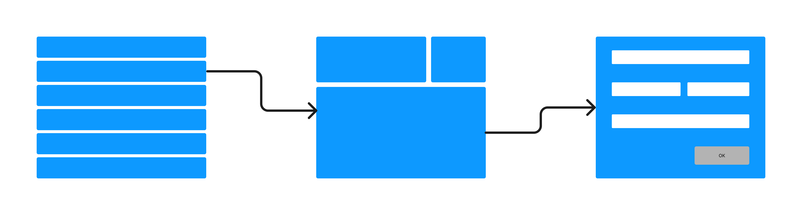
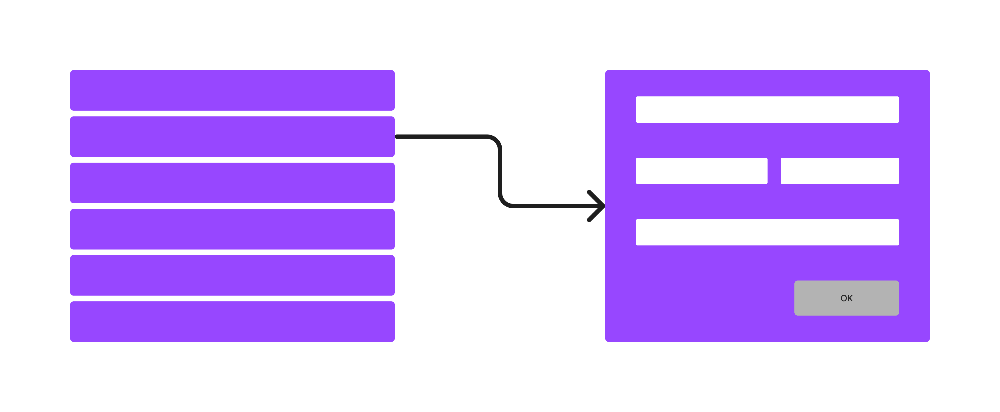
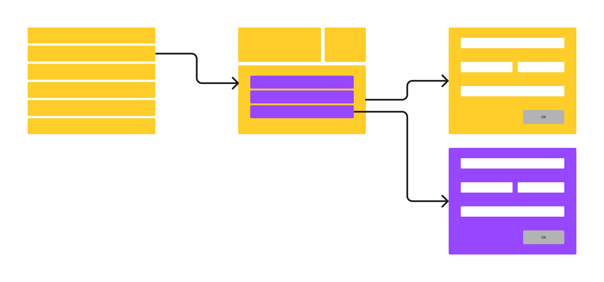

# Getting started

## Terminology, general concept

In Sharp, we handle `entities`; an `entity` is simply a data structure which has a meaning in the application context. For instance, a `Person`, a `Post` or an `Order`. In the Eloquent world, for which Sharp is optimized, it's typically a Model — but it's not necessarily a 1-1 relationship, a Sharp `entity` can represent a portion of a Model, or several Models.

An instance of an `entity` is simply called an `instance`.

Each `entity` in Sharp can be displayed:
- in an `Entity List`, which is the list of all the `instances` for this `entity`: with some configuration and code, the user can sort the data, add filters, pagination, and perform searches. From there we also gain access to applicative `commands` applied either to any particular `instance` or to the whole (filtered) list, and to a simple `state` changer (the published state of an Article, for instance). All of that is described below.
- In a `Show Page`, optionally, to display an `instance` details.
- And in a `Form`, either to update or create a new `instance`.

## Example

Let's take a simple example: we want to manage some shop, with 3 obvious entities: `Order`, `Customer` and `Product`. 

We want to be able to list all the **customers**, to display a detailed view for each of them, and to create or update a customer. That’s an `Entity List` linking to a `Show Page`, linking to a `Form`:

For **products**, we decide that we don't need to build a `Show Page`:

The product `Entity List` may have filters, sorting columns and search, and an `Entity state` to manage the published state of each product.

Finally, **orders** must be listed, detailed and updated, and we also need to manage the **product** list for each order. That's an `Entity List` linking to a `Show Page` which contains another `Entity List`:

Maybe we can add an `Entity Command` to export orders in a CSV file in the `Entity List`, and an `Instance command` on the order `Show Page` to declare the order as shipped.

This is a simple example to illustrate the main concepts of Sharp: we'll see in this guide how to build such structures but also more complex ones, and how to manage states, commands, dashboards, authorizations, errors, validation... in the process.
