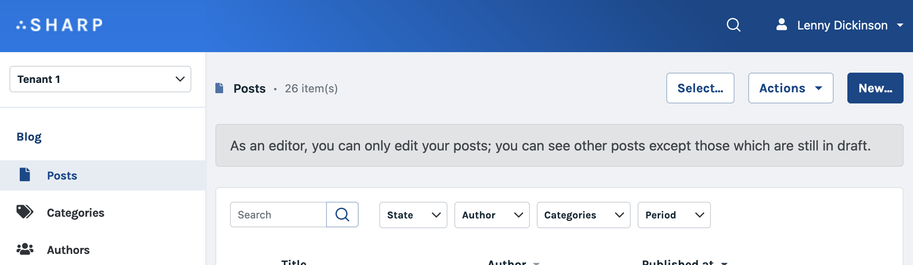

# Add global page alert

This feature makes it possible to add a message (with an alert or not) at the top of an Entity List, a Form (including a Command Form), a Show Page or a Dashboard.



A global page alert can be great to provide feedback to the user, to remind him of a particular state, to warn him of potential consequences of a Command...

## Declaration

Use the `configurePageAlert()` method, in the `buildXXXConfig()` method of your Entity List, Show Page, Command, Form or Dashboard:

```php
class PostShow extends SharpShow
{
    // [...]
    
   function buildShowConfig(): void
   {
       $this
           ->configurePageAlert(
               'Warning: this post is still in draft.',
           );
    }
}
```

This method accepts one to 4 arguments: `configurePageAlert(string $template, string $alertLevel = null, string $fieldKey = null, bool $declareTemplateAsPath = false)`

- `$template` is the only one required: you must provide here a Vue.js template, just like for Autocompletes fields or Dashboard panels
- `$alertLevel` formats the message as an alert, with the following possibilities:
    - `static::$pageAlertLevelNone`
    - `static::$pageAlertLevelInfo`
    - `static::$pageAlertLevelWarning`
    - `static::$pageAlertLevelDanger`
    - `static::$pageAlertLevelPrimary`
    - `static::$pageAlertLevelSecondary`
- `$fieldKey` allows to declare the key of a data to allow dynamic messages (see below)
- finally, if `$declareTemplateAsPath` is set to true then `$template` should be passed as a path to a template file.

## Dynamic messages

Page alerts can be dynamic, using the power of a regular Vue.js template. Here's a full example:

First we add dynamism in the template, and we define a `$fieldKey` to work with in the config, and reference it in the data part; here's an example in a Show Page:

```php
class PostShow extends SharpShow
{
    // [...]
    
    function buildShowConfig(): void
    {
        $this
            ->configurePageAlert(
                '<span v-if='is_draft'>Warning: this post is still in {{state}} state.</span>',
                static::$pageAlertLevelWarning,
                'globalMessage'
        );
    }
    
    function find($id): array
    {
        return $this
            ->setCustomTransformer('globalMessage', function($value, Post $post) {
                return [
                    'is_draft' => in_array($post->state, ['draft', 'pending']),
                    'state' => $post->state
                ];
            })
            ->transform(Post::findOrFail($id));
    }
}
```

Note that we use the dynamic data in two ways, in this example:

- the page alert will appear only if the post state is "draft" or "pending"
- and the actual state will be injected in the text message.

## The Dashboard case

For the Dashboard, the API is slightly different: first the 3rd argument of `configurePageAlert()`, `$fieldKey`, is not really used, since there is no field in a Dashboard.

Second, and more importantly, here's how you can handle data binding for dynamic messages:

```php
class CompanyDashboard extends SharpDashboard
{
    // [...]
    
    public function buildDashboardConfig(): void
    {
        $this->configurePageAlert('Graphs below are delimited by period {{period}}.');
    }
    
    protected function buildWidgetsData(): void
    {
        $period = $this->getQueryParams()->filterFor(PeriodFilter::class);
        $this->setPageAlertData([
            'period' => sprintf('%s - %s', $period['start'], $period['end']),
        ]);
    }
}
```