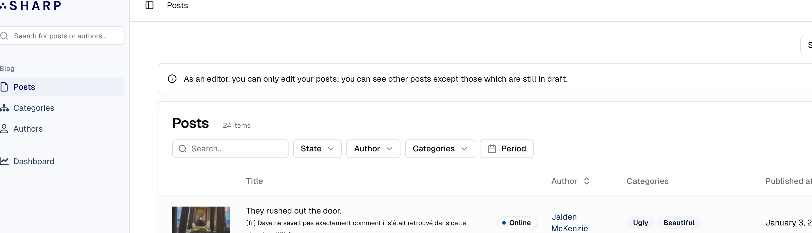

# Add global page alert

This feature makes it possible to add a message (with an alert or not) at the top of an Entity List, a Form (including a Command Form), a Show Page, a Dashboard or an Embed.



A global page alert can be great to provide feedback to the user, to remind him of a particular state, to warn him of potential consequences of a Command...

## Declaration

Create a `buildPageAlert()` method:

```php
class MyShow extends SharpShow
{
    // [...]
    
    protected function buildPageAlert(PageAlert $pageAlert): void
    {
        $pageAlert
            ->setLevelInfo()
            ->setMessage('This post is planned for publication');
    }
}
```

You can use several styles: `setLevelInfo()`, `setLevelWarning()`, `setLevelDanger()`, `setLevelPrimary()` or `setLevelSecondary()`.

## Dynamic messages

To provide a dynamic message, depending on the actual data of the Show, Entity List and so on, you can pass a closure to the `setMessage()` method:

```php
class MyShow extends SharpShow
{
    // [...]
    
    protected function buildPageAlert(PageAlert $pageAlert): void
    {
        $pageAlert
            ->setLevelInfo()
            ->setMessage(function (array $data) {
                return $data['is_planned']
                    ? 'This post is planned for publication, on ' . $data['published_at']
                    : null;
            });
    }
}
```

The `$data` array passed to the closure is the result of your `find()` (Show, Form), `getListData()` (Entity List), `buildWidgetsData()` (Dashboard) or `initialData()` (Command) method.

::: tip
If your message is complex to build, you can defer to a blade template to encapsulate the logic, eg:
`return view('sharp._post-planned-info', ['data' => $data])->render();`
:::