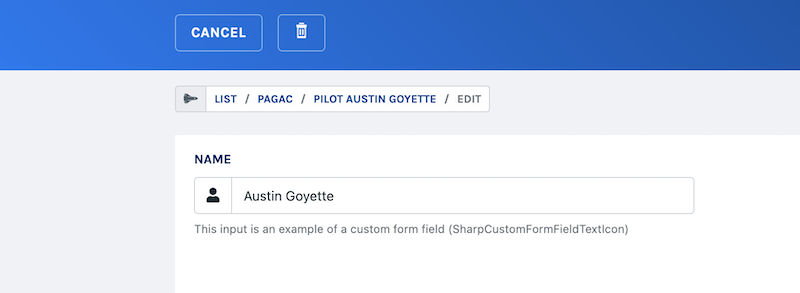

# Sharp's breadcrumb

Under the hood Sharp manages a breadcrumb to keep track of stacked pages.

## Display the breadcrumb



You can activate the breadcrumb display in sharp's configuration: 

```php
// config/sharp.php
return [
    [...],
    "display_breadcrumb" => true,
    [...]
];
```

## Configure entity label

In the config, you can define how an entity should be labeled in the breadcrumb with the `label` attribute:

```php
// config/sharp.php
return [
    [...],
    "entities" => [
        "entity_spaceship" => [
            "list" => \App\Sharp\SpaceshipSharpList::class,
            "show" => \App\Sharp\SpaceshipSharpShow::class,
            "form" => \App\Sharp\SpaceshipSharpForm::class,
            "label" => "Spaceship"
        ],
        [...],
    ],
    [...],
];
```

## Customize the label on an instance

In Forms and Shows, you can define which attribute should be used as the breadcrumb label, if you need to be specific.

```php
// In a SharpShow or a SharpForm
function buildShowConfig(): void
{
    $this->configureBreadcrumbCustomLabelAttribute("breadcrumb_label");
}
```

As any attribute, you can use a dedicated custom transformer to valuate it as you want:

```php
// In a SharpShow or a SharpForm
function find($id): array
{
    return $this
        ->setCustomTransformer("breadcrumb_label", function($role, $spaceship) {
            return sprintf("Spaceship %s", $spaceship->name);
        })
        ->transform(Spaceship::findOrFail($id));
}
```

::: note
In the Form, the breadcrumb label is only used in one particular case: when coming from an Embedded Entity List of a Show. In this case, the Show and the Form entity are different, and the breadcrumb helps to keep track of the current edited entity.
:::