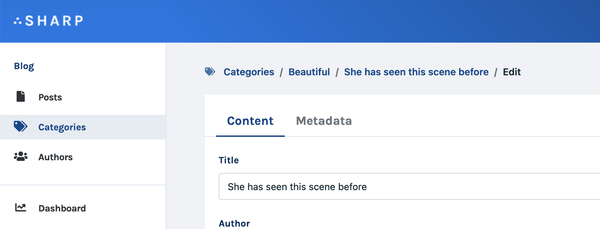

# Sharp's breadcrumb

Under the hood Sharp manages a breadcrumb to keep track of stacked pages.

## Display the breadcrumb



You can activate the breadcrumb display in sharp's configuration: 

```php
// config/sharp.php
return [
    // [...]
    
    "display_breadcrumb" => true,
];
```

## Configure entity label

In Entity classes, you can define how an entity should be labeled in the breadcrumb with the `label` attribute:

```php
class PostEntity extends \Code16\Sharp\Utils\Entities\SharpEntity
{
    // [...]
    
    protected string $label = = 'Post';
}
```

## Customize the label on an instance

In the Form and in the Show Page, you can define which attribute should be used as the breadcrumb label, if you need to be specific.

```php
class PostShow extends \Code16\Sharp\Show\SharpShow
{
    // [...]
    
    function buildShowConfig(): void
    {
        $this->configureBreadcrumbCustomLabelAttribute('title');
    }
}
```

As any attribute, you can use a dedicated custom transformer to valuate it as you want:

```php
class PostShow extends \Code16\Sharp\Show\SharpShow
{
    // [...]
    
    function buildShowConfig(): void
    {
        $this->configureBreadcrumbCustomLabelAttribute('breadcrumb_label');
    }
    
    function find($id): array
    {
        return $this
            ->setCustomTransformer('breadcrumb_label', function($role, $post) {
                return str($post->title)->limit(20);
            })
            ->transform(Post::findOrFail($id));
    }
}
```

::: tip
In the Form, the breadcrumb label is only used in one particular case: when coming from an embedded Entity List inside a Show Page. In this case, the Show Page and the Form entity are different, and the breadcrumb helps to keep track of the current edited entity.
:::