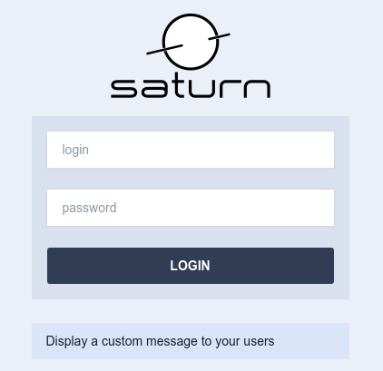

# Style & Visual Theme

### Custom colors

In Sharp 6, the primary color is customisable. It changes the header + buttons color. Although every hue works well, too light colors aren't supported (e.g. works well with [tailwind colors](https://tailwindcss.com/docs/customizing-colors#color-palette-reference) >= 600).

```php
// config/sharp.php

'theme' => [
    'primary_color' => "#004D40"
]
```

### Login and menu logos

By default, the `config('sharp.name')` is displayed on the login page and on top of the menu. You can if you wish display images instead: Sharp will look for PNGs named `login-icon.png` and `menu-icon.png`, in a `/public/sharp-assets/` directory. Note that :
- `login-icon.png` is limited to 200 pixels in width and 100 pixels in height,
- and `menu-icon.png` must fit in 150 pixels in width and 50 pixels in height.

If you need to configure the image files paths, you can do it with this config (note: paths are relative to /public/ directory):

```php
// config/sharp.php

"theme" => [
    "primary_color" => ...,
    "logos" => [
        "menu" => "sharp/subdir/my-custom-menu-icon.png",
        "login" => "sharp/subdir/my-custom-login-icon.png",
    ]
]
```

#### Display a custom message on login page

You can display a custom content under the form on login page:



You'll need to create a new template file:

```html
<!-- resources/views/sharp/_login-page-message.blade.php -->

<div class="alert alert-info">
    Display a custom message to your users
</div>
```

And then you'll need to define the path to this custom blade in the `config/sharp.php` config file:

```php
// config/sharp.php

"login_page_message_blade_path" => "sharp/_login-page-message",
```


### Injecting Assets

You may globally inject custom CSS files after the Sharp assets by defining their paths in the `config/sharp.php` config file.

```php
// config/sharp.php

"extensions" => [
   "assets" => [
      "strategy" => "raw",
      "head"     => [
         "/css/inject.css", // Outputs <link rel="stylesheet" href="/css/inject.css"> after sharp assets
      ],
   ],
],

// ...
```

The comment next to the item within the `head` position show how the output would appear in the HTML.

### Strategy

The `strategy` defines how the asset path will be rendered

- `raw` to output the path in the form it appears in your array
- `asset` to pass the path to the laravel [`asset()`](https://laravel.com/docs/5.6/helpers#method-asset) function
- `mix` to pass the path to the laravel [`mix()`](https://laravel.com/docs/5.6/helpers#method-mix) function 
