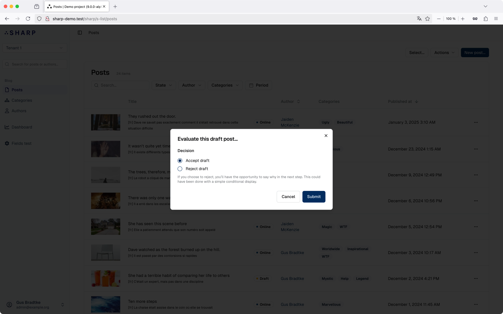
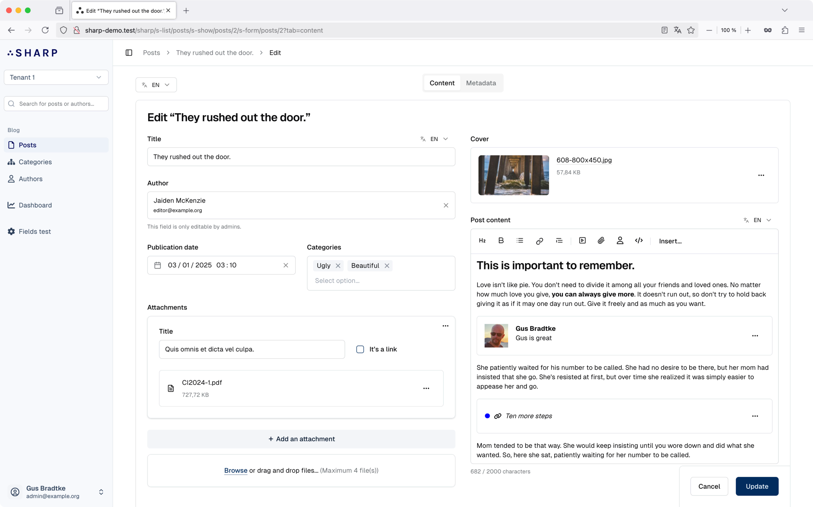
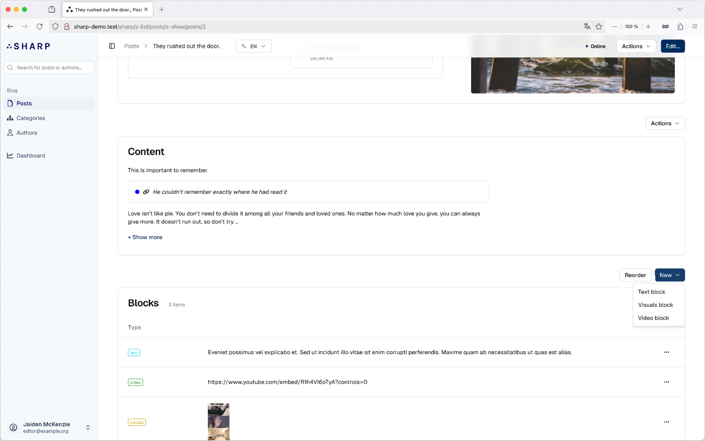
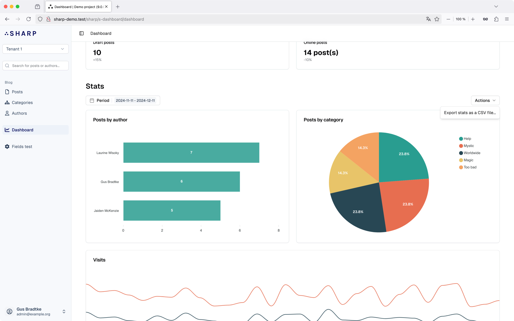
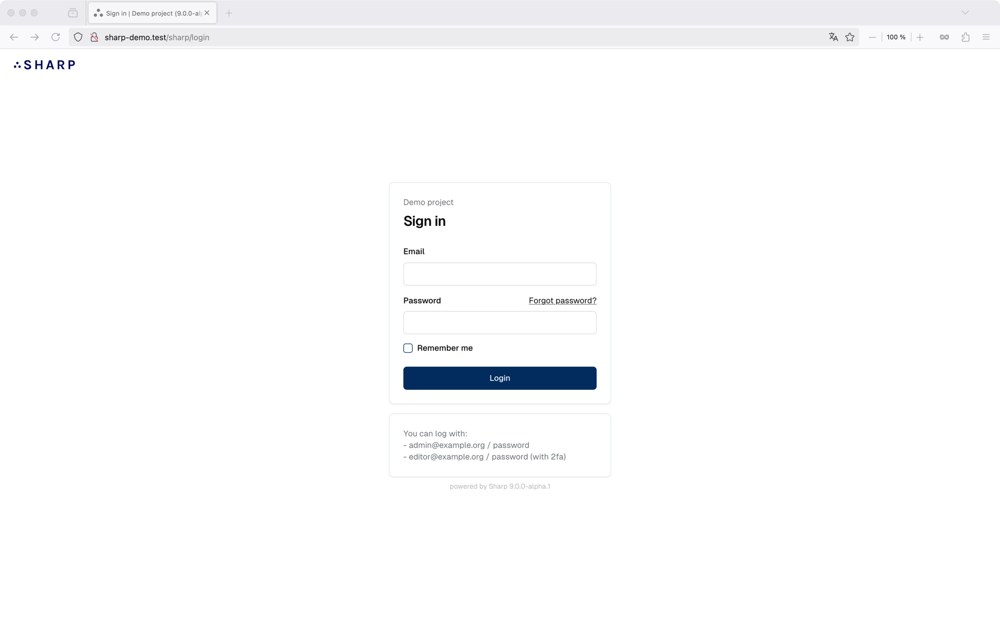
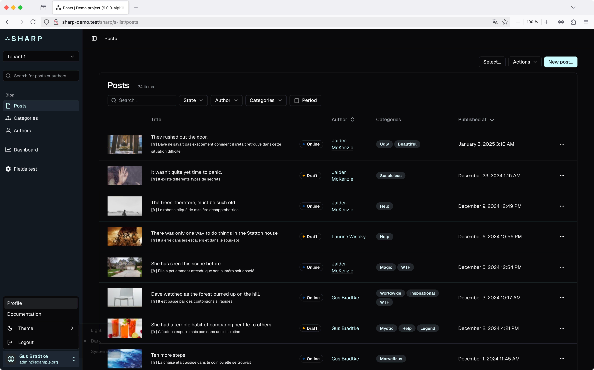

Sharp is a content management framework built for Laravel as a package, which provides great help to build a CMS section in a project with a clean UI and DX in mind. Sharp is driven by code: everything is manageable through a clean and documented PHP API, using Laravel conventions and coding style. It intends to avoid code adherence — the project should not have any knowledge of it — and is data-agnostic, meaning it does not have any expectations from the persistence layer.

Sharp for Laravel is actively maintained and developed and is used in all kinds of projects, from content-driven websites to e-commerce platforms and API backends.

# Main features

<section>

## Streamlined Lists

### Customizable columns
Choose and format the data to display and allow sorting.

### Search and filters
Define filters for your lists, with various types and options.

### State management
If your entities have some state, you can manage it easily from here.

<figure>

</figure>

</section>

<section>

## Powerful Command system

### Individual or bulk
Create commands to act on a single instance or on a selection (filtered list or user choice).

### Forms
Easily attach forms to commands, with validation and confirmation.

### Wizards
Create multistep commands with dynamic paths.

<figure>

</figure>

</section>

<section>

## Comprehensive Forms

### Fields and layout
Use one of the many fields available and organize them in a layout that fits your needs.

### Powerful editor with embeds
Sharp's custom editor really allows creating rich content and includes a clever system to develop custom embeds.

### Uploads
Manage files with bulk uploads, image transformation, disk and path configuration and precise validation.

### Lists
Create lists (repeaters) of custom items in your form.

<figure>

</figure>

</section>

<section>

## Detailed Show Pages

### Present an instance
Create a page to present an instance with a custom layout, with access to commands and state management.

### Embedded lists
Include lists in your show page to present linked data.

### Breadcrumb
Help your users to find their way up, allowing hierarchical navigation though embedded lists.

<figure>

</figure>

</section>

<section>

## Insightful Dashboards

### Widgets
Use various widgets to present synthetic data, graphs and direct links.

### Filters and commands
Leverage filters and commands in your dashboards.

<figure>

</figure>

</section>

<section>

## Authentication and authorizations

### Built-in authentication system
With fine-grained permissions managed by custom policies.

### Remember me, rate limiting, forgotten password
And impersonation in dev.

### 2FA
Out-of-the-box 2FA with TOTP or notification.

<figure>

</figure>

</section>

<section>

## And more

### Global search
Propose a custom global search to users.

### Global filters
Ideal for multi-tenant applications.

### Built-in localization
Manage translations for your entities.

### Quick creation UI
Allow your user to efficiently create new instances.

### Toast notifications and page alerts
To inform your users.

### Dark mode and theme color
The UI will adapt itself based on your primary color.

### Artisan commands
With prompts to generate lists, forms, commands, etc.

### Code-driven configuration
With a clean and documented API.

<figure>

</figure>

</section>

# About Sharp

Sharp is a long-term project developed by [Code 16](https://code16.fr), a web agency based in France, since 2017. We use it in almost all our projects, and we are committed to maintaining and improving it over time.

Sharp 9 relies on Laravel, Tailwind CSS, Inertia, Vue and Alpine.JS. 

So far we have not implemented any kind of sponsorship system, but we are open to discussing it in the future.

